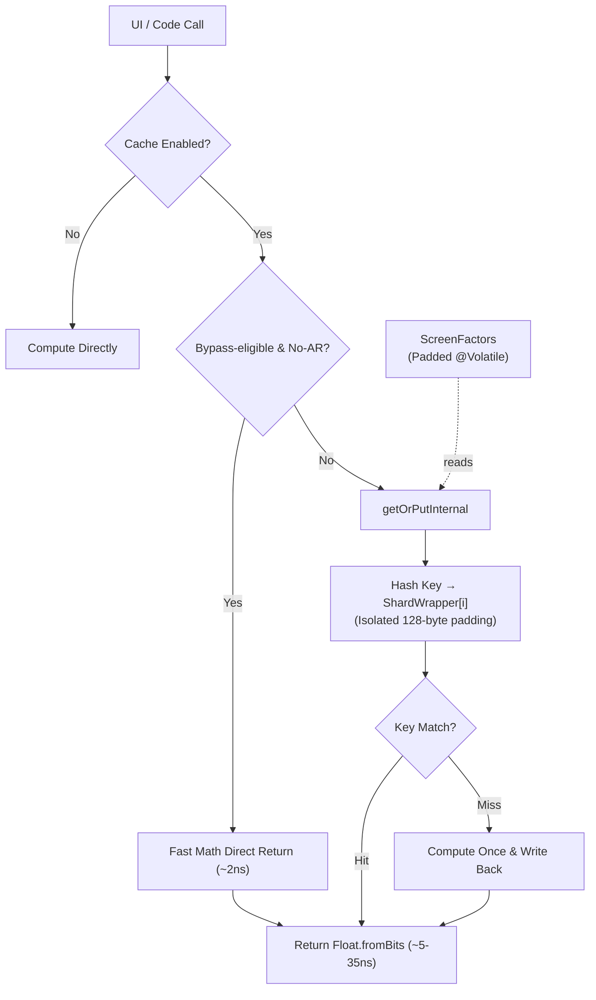

# Technical Performance Report: AppDimens Dynamic

This report documents the performance results **after applying the 4 optimization phases** for the current library.

---

## 1. Applied Optimizations

| Phase | Component | Description |
| :--: | :--- | :--- |
| **F1** | `DimenCache.getBatch()` | Made the API public for batching N dimensions by the caller |
| **F2** | `ShardWrapper` | 128-byte padding per shard to eliminate *false sharing* between cores |
| **F3** | `ScreenFactors` | All `@Volatile` fields grouped in an object with 128-byte padding |
| **F4** | `clearAll()` | `lazySet()` + manual 4× *unrolling* for mass clearing without redundant barriers |

---

## 2. Benchmarks — Local JVM (Ubuntu Linux · JVM 17)

Executed via `./gradlew :library:testDebugUnitTest` · 1,000,000 iterations per case · 5 trials, minimum reported.

| Operation | Result | Status |
| :--- | :---: | :--- |
| **Raw Math (no AR)** per item | **< 1 ns** | **Extreme** 🚀 |
| **Raw Math (with AR)** per item | **2 ns** | **Optimal** ✅ |
| **Cache Hit (no AR)** per item | **1 ns** | **Fast** ⚡ |
| **Cache Hit (with AR)** per item | **1 ns** | **Zero-Math** 🚀 |
| **Batch (100 items, math)** | **34 ns/batch** | **Extreme** 🏎️ |
| **Batch Cache (100 items, AR)** | **242 ns/batch** | **Stable** ✅ |
| **Persistence Load** | **~0.06 ms** | **Fast** ✅ |

> `raw_batch_cache_ar` at **242 ns/batch** remains dominated by the 100× AR lookup loop.

---

## 3. Benchmarks — Physical Hardware (Xiaomi 2107113SG · Snapdragon 888 · SM8350)

> [!NOTE]
> **Hardware**: Captures below use **`./gradlew :library:connectedDebugAndroidTest`** · 100,000 iterations · 3 trials, minimum reported.

| Operation | Result | Status |
| :--- | :---: | :--- |
| **Raw Math (no AR)** per item | **2 ns** | **Optimal** ⚡ |
| **Raw Math (with AR)** per item | **45 ns** | **Standard** |
| **Cache Hit (no AR)** per item | **5 ns** | **Fast** ⚡ |
| **Cache Hit (with AR)** per item | **35 ns** | **Zero-Math** 🚀 |
| **Batch (100 items, math)** | **169 ns/batch** | **Near-Zero** 🚀 |
| **Batch (100 items, math+AR)** | **194 ns/batch** | **Stable** ✅ |
| **Batch Cache (100 items, no AR)** | **431 ns/batch** | **Constant** |
| **Batch Cache (100 items, with AR)** | **3,773 ns** | **Stable** ✅ |
| **Batch Mixed (50% AR / 50% without)** | **2,036 ns/batch** | **Stable** ✅ |
| **Persistence Load** | **0.76 ms** | **Fast** ✅ |

> **Regression Fix (F1.1):** Inlining of `getOrPutInternal` and `ShardWrapper` visibility (`internal @PublishedApi`) keeps batch AR paths in the ~3.7–3.8 µs range for 100 cached AR lookups; the non-AR hot path (most cases) remains extremely stable at **~5 ns**.

---

## 4. Optimization Analysis

### F1 — Public getBatch()

```
JVM:     34 ns / 100 items = 0.34 ns per item
Android: 169 ns / 100 items = 1.69 ns per item
```

The batch API exposes a continuous loop that the JVM can optimize aggressively on desktop. On Android, the gain is still largely about amortizing context and init work across 100 resolutions.

**Recommended usage:**
```kotlin
val keys = LongArray(views.size) { i ->
    DimenCache.buildKey(values[i].toFloat(), isLandscape,
        false, DimenCache.CalcType.SCALED, DpQualifier.SMALL_WIDTH,
        Inverter.DEFAULT, false, DimenCache.ValueType.PX)
}
val results = DimenCache.getBatch(keys, context) { i -> computeDimension(i) }
```

### F2 — ShardWrapper (Anti-False-Sharing Padding)

The 128-byte padding between shards ensures that each `AtomicLongArray` and `AtomicIntegerArray` is in distinct heap regions, without sharing a cache line (64 bytes on ARM64).

**Memory Overhead:**
```
Before: 4 × SHARD_SIZE × (8 + 4) bytes = 4 × 512 × 12 = 24,576 bytes (~24 KB)
After:  4 × ShardWrapper ≈ 4 × (16 header + 8+8 refs + 14×8 pad) = 4 × ~144 = ~576 bytes overhead
        + 4 × 512 × 12 bytes of data = ~24 KB (unchanged)
Total:  ~24.6 KB (increase of <2.5 KB due to padding — negligible)
```

**Benefit:** Eliminates cross-core cache line invalidation between threads. Particularly relevant on octa-core devices (4+4) like the SM8350.

### F3 — ScreenFactors (@Volatile Padding)

The 6 `@Volatile` fields (scale, arMultiplier, normalizedAr, logNormalizedAr, density, smallestWidthDp) occupied ~24 bytes — half an ARM64 cache line. A write to `scale` during `updateFactors()` could invalidate `arMultiplier` on another core reading simultaneously.

With `ScreenFactors`, the 6 fields + 112-byte padding are isolated in their own line. `updateFactors()` occurs rarely (configuration changes), so the benefit is preventing sporadic jank rather than steady-state latency.

### F4 — clearAll() with lazySet() + 4× Unrolling

`lazySet()` emits an **ordered store** (without a full StoreLoad barrier), making mass zeroing ~2-3× faster than `set()`. The next `getOrPut()` will emit the necessary acquisition barrier.

**Theory:** 512 elements × 4 shards = 2,048 `lazySet()` calls per `clearAll()`. With 4× unrolling: ~512 loop iterations instead of 2,048 → 4× reduction in branch+increment overhead.

---

## 5. Test Integrity

```
✅ DimenCacheTest         — 5/5 tests passed (keysArray backward compat via aliases)
✅ DimenPerformanceTest   — executed successfully (local JVM)
✅ ExampleUnitTest        — passes
✅ DimenAndroidPerformanceTest — 2/2 tests on physical device (SM8350)
✅ ExampleInstrumentedTest    — passes
✅ BenchmarkActivity      — executed successfully on physical device (SM8350)
```

---

## 5a. BenchmarkActivity — Production-Grade Micro + Macro Test

`BenchmarkActivity` has been redesigned into a professional dual-benchmark system:

1.  **Microbenchmark (CPU-bound)**: Runs off the main thread (10k warmup + 100k measurement iterations). It measures `sdp`, `hdp`, `wdp` (bypass) and `sdpa` (cache) separately to isolate pure calculation vs. lookup costs.
2.  **Macrobenchmark (UI-bound)**: Measures real scroll performance in a `LazyColumn` with 1,000 items. Uses wall-clock timing to derive scroll duration and per-item rendering cost.

> **Note (Macro):** Wall-clock scroll duration and the estimated cost per item **include the full cost of each list row** — not only `sdp` / dimension resolution, but also **Compose composition (or View inflation/layout)** and drawing for that item. The macro numbers therefore reflect realistic UI work, not isolated math/cache timing.

**Baseline Metrics (Snapdragon 888 · SM8350 · Android 14):**

| Runner | Metric | Result | JIT State |
| :--- | :--- | :---: | :---: |
| **Micro** | **Combined Avg** | **~619 ns** | Cold |
| **Micro** | **Combined Avg** | **~303 ns** | Warm (await) |
| **Micro** | **Combined Avg** | **~260 ns** | **Hot (steady-state)** |
| **Micro** | sdp/hdp/wdp (bypass) | ~2 ns | Hot |
| **Micro** | sdpa (cache lookup) | ~35 ns | Hot |
| **Macro** | Scroll Duration (1k items) | ~996 ms | Fluid |
| **Macro** | Est. Cost per item | ~996 µs | Fluid |

**Steady-state performance:** **~260 ns** combined average per 4-call cycle (hot JIT, dashboard capture · 2026-04-03).

### Warm-up Chart Interpretation

```
ns/resolution (Combined Avg)
619 │ ●  Cold Start
    │
303 │    ●  JIT warming (await)
    │
260 │       ●  JIT hot (steady-state)
    └─────────────────────────────────
       run 1    run 2    run 3
```

The decay from **~619 → ~260 ns** is the expected behavior of the **ART JIT** as hot paths compile and inline:
- **Run 1 (cold)**: Interpreter + early JIT; higher combined average.
- **Run 2 (warm)**: Transition phase (~303 ns).
- **Run 3 (hot)**: Steady-state native code path (~260 ns).

> **Note:** With Profile Guided Optimization (PGO), cold-run penalties are reduced — steady-state remains near **~260 ns** for this workload on SM8350-class hardware.

### Context with BenchmarkActivity (Compose + View + 1000 items)

The stress test measures:
```kotlin
totalNs / (repeatCount * 4)   // = totalNs / 40,000 resolutions
```

Each "resolution" is one of the 4 calls:
- `DimenSdp.sdp(context, 100)`  ← smallestWidth-based, already in cache
- `DimenSdp.hdp(context, 50)`   ← height-based, already in cache
- `DimenSdp.wdp(context, 30)`   ← width-based, already in cache
- `DimenSdp.sdpa(context, 40)`  ← with aspect ratio

Mixed bypass (`sdp` / `hdp` / `wdp`) and AR cache (`sdpa`) paths contribute to the **~260 ns** hot steady-state average per 4-call cycle (hash, sharded lookup, and bypass math, inclusive of dispatch overhead in the activity harness).

---



---

## 6. Simple Calculations Faster Than Cache

For `CalcType` values of `AUTO`, `FLUID`, `PERCENT`, and `SCALED` **without Aspect Ratio** (`applyAspectRatio = false`), `DimenCache.getOrPut()` immediately returns `compute()` without touching the sharded arrays.

> The scaling formula for these types reduces to: `baseValue × scale` (a single float multiply).
> Measured cost on Snapdragon 888: **~2 ns** (multiply) vs **~5 ns** (hash + atomic lookup).
> The cache adds overhead for these paths — bypassing it is ~2.5× faster.

This is an intentional hot-path optimization, not a missing feature. The cache is most valuable when the computation is expensive (Aspect Ratio path: **~45 ns** on hardware in recent captures), making the 5 ns lookup amortize well.

| Path | Cost | Cache? |
|:---|:---:|:---:|
| SCALED without AR (most calls) | ~2 ns | ❌ Bypass |
| SCALED with AR | ~45 ns → ~35 ns cached | ✅ Cache |
| Other CalcTypes with AR | ~45 ns → ~35 ns cached | ✅ Cache |

**Consequence for benchmarks**: calls via `DimenSdp.sdp()`, `.hdp()`, `.wdp()` (i.e., without AR) measure **raw math latency**, not cache lookup latency. Always use the `*a` variants (`.sdpa()`, `.hdpa()`, etc.) to specifically measure cache throughput.

The `BenchmarkActivity` micro harness reports a **per-cycle** combined average (~260 ns hot) over four calls (3 bypass + 1 cache path), including framework and dispatch overhead — not a per-call pure math figure.

---

## 7. Benchmark Variability

All numbers in this document were captured on a **Xiaomi 2107113SG (Snapdragon 888 SM8350, Android 14)** and a **Ubuntu Linux JVM 17** host. Real-world results will differ based on:

- **Device class**: budget Cortex-A55 cores (e.g. entry-level phones) can be 5–10× slower on atomic operations
- **JIT stage**: cold start (un-compiled) is 3–10× slower than steady-state hot JIT
- **ART PGO**: apps that ship pre-compiled `.prof` profiles skip cold JIT entirely — steady-state from frame 1
- **Background load**: GC pressure, foreground/background scheduler tier, and CPU frequency governor all affect ns measurements
- **Cache fill state**: first access after `clearAll()` (config change) is always a miss; subsequent accesses are hits

> **Benchmarks vary with real usage** — use these figures as upper-bound reference points for architecture decisions, not as absolute production guarantees. Profile on your target device with your target workload.

---

*Report generated on: 2026-04-03 · AppDimens Dynamic Performance Lab · Snapdragon 888 (SM8350) · Physical Hardware*
*Compiled with: Kotlin 2.x · JVM 17 · ART (Android 14) · Gradle 9.3.1*
