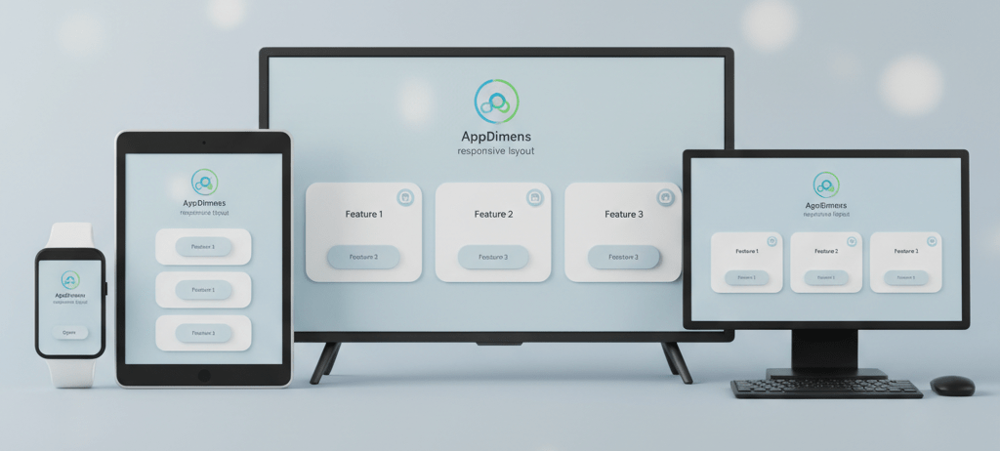
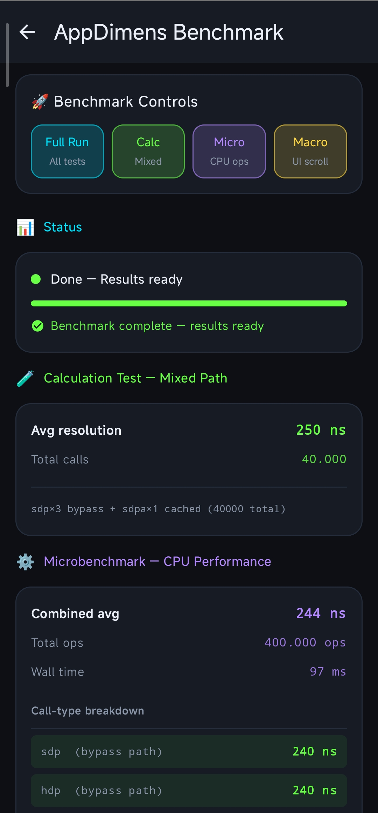

# AppDimens Dynamic

## Kotlin Multiplatform · Compose Multiplatform · Android

Biblioteca **KMP** com API comum em `commonMain` e integração **Compose Multiplatform** (Android, desktop JVM, iOS via Kotlin/Native). Continua a oferecer o mesmo modelo de `dp` / `sp` responsivos; em Android também podes usar **Jetpack Compose** com as extensões existentes.

<p align="center">
  <a href="https://github.com/bodenberg/appdimens-dynamic/releases" title="Releases">
    
  </a>
  &nbsp;
  <a href="LICENSE" title="Apache License 2.0">
    
  </a>
  &nbsp;
  
  &nbsp;
  
  &nbsp;
  <a href="https://developer.android.com" title="Android">
    
  </a>
  &nbsp;
  
  &nbsp;
  
  &nbsp;
  
  &nbsp;
  <a href="./DOCUMENTATION/README.md" title="Scaling strategies and modules">
    
  </a>
</p>

**Módulos:** `:library` (publicação Maven) · `:composeApp` + `:androidApp` (amostra CMP + APK) · `:app` (Android clássico em [`samples/legacy-app/`](samples/legacy-app/) — ver [MIGRATION_KMP.md](./MIGRATION_KMP.md)). Amostra iOS: abrir [`iosApp/AppDimensSample.xcodeproj`](iosApp/AppDimensSample.xcodeproj) no Xcode — [iosApp/README.md](./iosApp/README.md).

<p align="center">
  <a href="./GUIDE-FOR-BEGINNERS.md" title="Step-by-step guide for beginners">
    
  </a>
  &nbsp;&nbsp;
  <a href="./DOCUMENTATION/README.md" title="Strategies, formulas, and when to use each scaling mode">
    
  </a>
  &nbsp;&nbsp;
  <a href="./DOCUMENTATION/index.md" title="API documentation — Markdown package index (KDoc export)">
    
  </a>
  &nbsp;&nbsp;
  <a href="https://appdimens3.web.app/" title="Hosted Dokka — searchable API reference">
    
  </a>
</p>

---



One dependency: you write values like `16.sdp` and the library scales them from the current screen **Configuration** (size, density, optional flags).

**New here?** Use **Quick start** below, then [**GUIDE-FOR-BEGINNERS**](./GUIDE-FOR-BEGINNERS) for every strategy in plain language.

**All 14 modes** (scaled, percent, power, fluid, …): [DOCUMENTATION/README.md](DOCUMENTATION/README.md) · [KDoc (hosted)](https://appdimens3.web.app/)

---

## Installation

```kotlin
dependencies {
    implementation("io.github.bodenberg:appdimens-dynamic:4.0.0")
}
```

**KMP / CMP:** alvos **Android**, **desktop (JVM)** e **iOS** (compilação iOS só em macOS). Guia completo: [MIGRATION_KMP.md](./MIGRATION_KMP.md) (`ScreenMetricsSnapshot`, cache por plataforma, AGP 9, CI, amostra Xcode em `iosApp/`). **Web (js/wasm):** não incluído — o `commonMain` da biblioteca ainda depende de APIs/anotações JVM alinhadas a Android/desktop; ver secção *Web* no guia.

**Requirements:** Min SDK **24** (amostra **:androidApp** / **:composeApp** usam **25** onde aplicável) · Compile SDK **36** · **Kotlin** & **Java 17** · versão **Compose Multiplatform** alinhada ao [`:library`](gradle/libs.versions.toml)

---

## Quick start — Scaled (Compose)

**Scaled** uses **300 dp** as the design reference. It is the **most widely used** strategy in real apps and the **recommended default**: use plain `sdp` / `hdp` / `wdp` / `ssp` when a single curve is enough, and the **`a`** suffix (aspect ratio–aware), e.g. `16.sdpa`, when you want scaling tuned to screen shape. **After Scaled**, the next strategies teams typically adopt are **percent** (sizes as a fraction of an axis) and **auto** (breakpoint-style steps); the other modes are for specialized layouts — see [DOCUMENTATION/README.md](DOCUMENTATION/README.md).

| Extension | Based on | Typical use |
|-----------|----------|-------------|
| **`sdp`** | Smallest window width | Padding, margins |
| **`hdp`** | Screen height | Row height |
| **`wdp`** | Screen width | Column width |
| **`ssp`** | Same idea as `sdp`, for text | `fontSize` |

```kotlin
import com.appdimens.dynamic.compose.*

Box(
    Modifier
        .padding(16.sdp)
        .width(100.wdp)
        .height(48.hdp)
) {
    Text("Hello", fontSize = 16.ssp)
}
```

---

## Compose — setup before advanced APIs

**If you only use `sdp` / `hdp` / `wdp` / `ssp` (and variants like `sdpa`), you can skip this block.**

### `AppDimensProvider`

Use it when you call **`.sdpMode`**, **`.sdpScreen`**, **`.sspMode`**, **`.sspScreen`**, or similar **facilitators** that depend on **UI mode / fold state**. It sets `LocalUiModeType` once for the tree instead of resolving mode on every call.

```kotlin
import com.appdimens.dynamic.core.AppDimensProvider

setContent {
    AppDimensProvider {
        MyApp()
    }
}
```

### `DimenCache.invalidateOnConfigChange`

Call this when the **same Activity** stays alive across **rotation, split-screen, or density/font changes** and sizes look **stale**. If the Activity is **recreated** on config change (default), you often don’t need it. Details: [library/PERFORMANCE.md](library/PERFORMANCE.md).

```kotlin
import android.content.res.Configuration
import com.appdimens.dynamic.core.DimenCache

private var lastConfiguration: Configuration? = null

override fun onCreate(savedInstanceState: Bundle?) {
    super.onCreate(savedInstanceState)
    lastConfiguration = Configuration(resources.configuration)
}

override fun onConfigurationChanged(newConfig: Configuration) {
    DimenCache.invalidateOnConfigChange(lastConfiguration, newConfig)
    lastConfiguration = Configuration(newConfig)
    super.onConfigurationChanged(newConfig)
}
```

You only get `onConfigurationChanged` if the Activity lists `android:configChanges` for those changes in the manifest; otherwise the process usually recreates the Activity and config is fresh automatically.

---

## Compose — next steps

### Suffixes (`a`, `i`, `ia`)

| Suffix | Meaning |
|--------|---------|
| *(none)* | Default |
| **`a`** | Aspect ratio–aware curve |
| **`i`** | Ignore multi-window heuristic (may return unscaled base when it triggers) |
| **`ia`** | Both |

```kotlin
16.sdpa      // + aspect ratio
32.hdpi      // height axis + ignore multi-window
16.sspa      // scalable sp + aspect ratio
```

### More text styles

```kotlin
Text("Scaled (sw)", fontSize = 16.ssp)
Text("Scaled (height)", fontSize = 20.hsp)
Text("Scaled (width)", fontSize = 18.wsp)
Text("No system font scale (sw)", fontSize = 16.nem)   // nem / hem / wem
```

### Orientation inverters (examples)

```kotlin
32.sdpPh   // SW-based; in portrait uses height
32.sdpLw   // SW-based; in landscape uses width
50.hdpLw   // Height-based; in landscape uses width
50.wdpLh   // Width-based; in landscape uses height
```

### Facilitators (after `AppDimensProvider` if you use mode/screen)

```kotlin
import com.appdimens.dynamic.compose.*
import com.appdimens.dynamic.common.DpQualifier
import com.appdimens.dynamic.common.Orientation
import com.appdimens.dynamic.common.UiModeType

80.sdpRotate(50, orientation = Orientation.LANDSCAPE)
30.sdpMode(200, UiModeType.TELEVISION)
60.sdpQualifier(120, DpQualifier.SMALL_WIDTH, 600)
16.sspRotate(24, orientation = Orientation.LANDSCAPE)
```

Full catalog: [DOCUMENTATION/COMPOSE-API-CONVENTIONS.md](DOCUMENTATION/COMPOSE-API-CONVENTIONS.md).

### Builders (`scaledDp` / `scaledSp`)

```kotlin
val pad = 16.scaledDp()
    .aspectRatio(true)
    .screen(UiModeType.TELEVISION, 40)
    .screen(DpQualifier.SMALL_WIDTH, 600, 24)
    .sdp
```

### Auto-resize (inside `BoxWithConstraints`)

Picks the **largest** font or size in a **min…max** range that still **fits** the space. Use for titles, squares, etc.

```kotlin
import androidx.compose.foundation.layout.BoxWithConstraints
import androidx.compose.foundation.layout.fillMaxWidth
import androidx.compose.ui.Modifier
import com.appdimens.dynamic.compose.resize.autoResizeTextSp

BoxWithConstraints(Modifier.fillMaxWidth()) {
    val fontSize = autoResizeTextSp(
        text = "Headline that must fit",
        minSp = 12,
        maxSp = 28,
        stepSp = 1,
        maxLines = 2,
    )
    Text("Headline that must fit", fontSize = fontSize, maxLines = 2)
}
```

More APIs (`autoResizeSquareSize`, `ResizeBound`, …): [DOCUMENTATION/resize.md](DOCUMENTATION/resize.md).

---

## Kotlin (Views / non-Composable)

```kotlin
import com.appdimens.dynamic.code.DimenSdp
import com.appdimens.dynamic.code.DimenSsp

val paddingPx = DimenSdp.sdp(context, 16)
val heightPx = DimenSdp.hdp(context, 32)
val widthPx = DimenSdp.wdp(context, 100)
val fontPx = DimenSsp.ssp(context, 16)

// Extensions (see code package)
// 16.ssp(context), DimenSdp.scaled(16).screen(...).sdp(context), sdpRotate, …
```

---

## Java

```java
import com.appdimens.dynamic.code.DimenSdp;
import com.appdimens.dynamic.code.DimenScaled;
import com.appdimens.dynamic.code.DimenSsp;
import com.appdimens.dynamic.common.UiModeType;

float paddingPx = DimenSdp.sdp(context, 16);
float heightPx = DimenSdp.hdp(context, 32);
float fontPx = DimenSsp.ssp(context, 16);

DimenScaled scaled = DimenSdp.scaled(16)
    .applyAspectRatio(true)
    .screen(UiModeType.TELEVISION, 32);
float result = scaled.sdp(context);
```

---

## Physical units (mm, cm, inch)

Approximate **real-world** size on screen (density-based). Compose: use helpers from the library and **`.dp`** on the result where needed — see [DOCUMENTATION/physical-units.md](DOCUMENTATION/physical-units.md). Code module: `com.appdimens.dynamic.code.units.DimenPhysicalUnits` (`toDpFromMm`, …).

---

<p align="center">
  
  &nbsp;
  
</p>

---

## More strategies & full API

**Recommendation order for most apps:** **Scaled** (with or without `a`) → then **percent** → then **auto**; explore the rest when you have a clear need (fluid, fit, diagonal, etc.).

Other strategies (**percent**, **power**, **fluid**, **auto**, **diagonal**, **fill**, **fit**, **interpolated**, **logarithmic**, **perimeter**, **density**) use the **same suffix patterns** as Scaled with a **different import prefix** — see [DOCUMENTATION/README.md](DOCUMENTATION/README.md) and [**GUIDE-FOR-BEGINNERS**](./GUIDE-FOR-BEGINNERS).

| Resource | Use for |
|----------|---------|
| [DOCUMENTATION/README.md](DOCUMENTATION/README.md) | Per-strategy explanations |
| [COMPOSE-API-CONVENTIONS.md](DOCUMENTATION/COMPOSE-API-CONVENTIONS.md) | Every Compose property & facilitator (scaled catalog + prefix map) |
| [DOCUMENTATION/index.md](DOCUMENTATION/index.md) | Markdown API index (KDoc export) |
| [appdimens3.web.app](https://appdimens3.web.app/) | Searchable KDoc |

**Example app:** `samples/legacy-app/.../compose/ExampleActivity.kt` (includes auto-resize demos).

---

## Optional: cache & performance

- Results are cached in **`DimenCache`** (lock-free, optional persistence).
- Some paths **skip** storing in the shard table when a cheap multiply is enough — see [library/PERFORMANCE.md](library/PERFORMANCE.md).
- **Batch / low-level keys:** not needed for normal app code; library extensions already use the cache.

---

## Highlights (v3.x)

- Code-only scaling (no XML dimen grids) · **SDP / HDP / WDP** + **14** scaling modes  
- **Aspect ratio** & **multi-window** flags · **Inverters** & **facilitators** · **Foldable** awareness via WindowManager  
- **Physical units** · **Resize** helpers · **DimenScaled** chains  

---

*Apache License 2.0 — responsive layout utilities for Android.*
